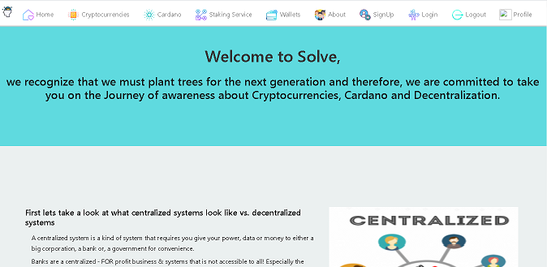

# Solve Staking

## Table Of Contents:
* Description
* How to use
* Technology Used/Badges
* Contributors

## Description: 
The purpose of the website is to educate people on decentralization, open source systems and crypo currency. Currently this is purely an educational website but in the near future we will offer our own staking pool service.
## How to use:
Simply travel to our deployed link: and begin learning! We aimed to have a desktop and mobile friendly design so feel try to try it on either platform. 

## Technologies Used/Bagdes: 
  
 
## Lisence:  
MIT
## Contributors:
# GitHubs:
Backend: 
[Edwin Genova](https://github.com/novaaaax) 
[Trion Bailey](https://github.com/trionb) 
Frontend: 
[Paul Fodrovics](https://github.com/Shift4change) 
[Long Nguyen](https://github.com/LNguyen95uzi)
